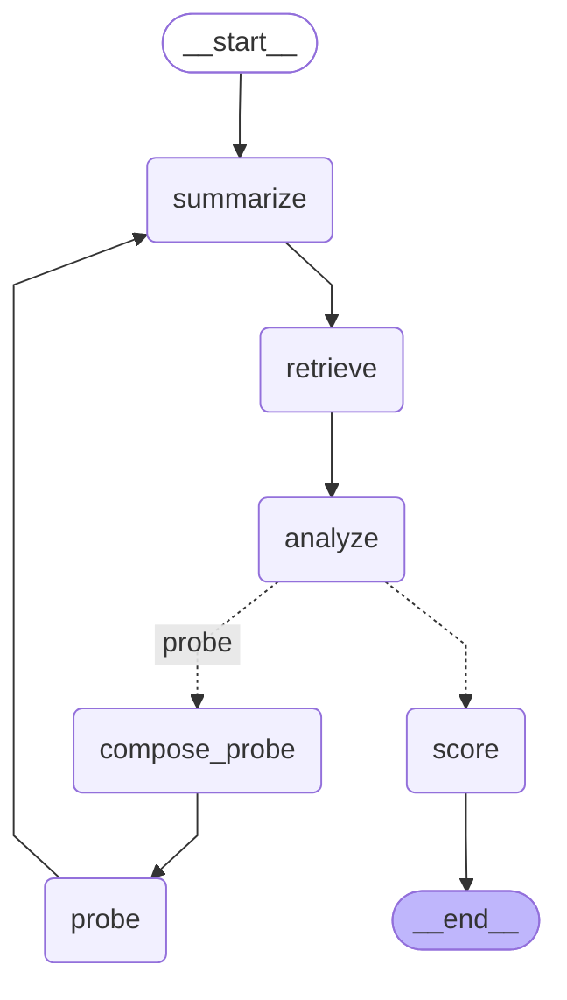

# Voice Screening Agent

A voice agent that runs one technical screening turn end to end: it asks a .NET interview question
aloud, transcribes the spoken answer (including code-mixed Egyptian Arabic / English), decides
whether to ask exactly one follow-up, then scores the answer 1–5 against a retrieved rubric and
speaks the verdict back in the candidate's language.

## Features

- Spoken question via ElevenLabs TTS, spoken verdict in the detected language (Arabic in → Arabic out).
- ElevenLabs Scribe STT — keeps English technical terms in Latin script inside Arabic speech.
- A real branch, not a script: the agent asks at most one follow-up, or moves straight to scoring.
- RAG over the provided corpus with a local embedding model — no vector database to run.
- Structured 1–5 evaluation: covered competencies, missing competencies, one-line justification.
- Mic capture or file upload from the browser; no build step for the UI.
- Candidate-facing interview report (score, strengths, gaps, recommendation) with the full
  pipeline trace kept behind a collapsed **Developer Diagnostics** panel.

## Requirements

- Python 3.11
- [uv](https://docs.astral.sh/uv/)
- API keys: `GROQ_API_KEY`, `ELEVENLABS_API_KEY`

## Quick start

```bash
git clone git@github.com:Elbhnasy/Momenta-soft-task.git
cd Momenta-soft-task
cp .env.example .env
```

Open `.env` and fill in both keys — `GROQ_API_KEY` (LLM) and `ELEVENLABS_API_KEY` (STT + TTS).

```bash
uv sync
uv run uvicorn app.main:app
```

Open <http://localhost:8000>.

Click **Start Interview** (the browser asks for mic permission at that point; this works on
`localhost`), then **Record Answer** — or **Upload Audio** to submit one of the sample answers in
`data/audio/`. Both paths hit the same endpoints. If the agent decides a follow-up is needed it
asks one, then produces the final report.

The report is the candidate-facing view. Everything the pipeline produced — transcript, retrieved
rubric chunks, coverage map, follow-up decision, raw evaluation JSON and turn metadata — stays
available under **Developer Diagnostics** at the foot of the page, collapsed by default and kept
per turn.

## Running the evaluation samples

```bash
uv run python scripts/eval_samples.py
```

Runs all three `data/audio/` samples through the graph — no server needed — writes
`artifacts/eval_<n>.json` and `artifacts/summary.md`, and exits non-zero if any assertion fails.
Takes a few minutes: samples are spaced 55 s apart to stay inside the Groq free-tier rate limit.
The committed run in `artifacts/summary.md` is 3/3 passing.

## Running tests

```bash
uv run pytest
```

Offline — no API keys needed.

## Project structure

```
app/
  api/          FastAPI routes
  graph/        LangGraph nodes, LLM judge, follow-up policy
  providers/    STT, TTS, LLM, embeddings
  rag/          chunking + cosine retrieval
prompts/        prompt templates (one file per stage)
data/
  corpus/       provided rubric + reference documents
  audio/        provided sample answers
static/         browser UI — index.html (markup + inline JS) and styles.css; no build step
scripts/        quality gate
tests/          offline regression tests
```

## Design notes

### Architecture



One FastAPI process. Audio is transcribed in the route handler, never inside a graph node — the
graph only ever sees text. When a follow-up is needed the graph suspends on `interrupt()`; the
candidate's follow-up answer arrives on a second HTTP request (`POST
/api/screening/{thread_id}/resume`) and resumes the same computation from an `InMemorySaver`
checkpoint. `probe → summarize` is a real cycle: the merged transcript is re-analyzed before scoring.

### How the follow-up decision works

The LLM does the open-ended part — it judges all five rubric competencies as
`covered` / `partial` / `missing`, each with a verbatim quote from the transcript. *Given* that
coverage map, the branch is a deterministic rule in `app/graph/policy.py`: probe only when there is
exactly one gap, skip when everything is covered, and skip when the answer is weak across the board
(one question cannot rescue it). The one-follow-up cap lives in code, not in a prompt, so it cannot
drift into a loop. No transcript-length or keyword heuristics anywhere — the branches are unit
tested offline in `tests/test_policy.py`.

### Retrieval

All five rubric competencies from `data/corpus/00_scoring_rubric.md` are injected into every
coverage and score call, so retrieval can never narrow what gets evaluated. The cosine index holds
only the five supplemental reference documents, two of which are planted distractors, and returns
the single best match (`k=1`). Queries use the English claims summary rather than the raw
transcript, which keeps retrieval quality stable for Arabic answers.

### How I'd know a change made the system worse

The gate checks score agreement with the hand-labelled `tests/golden.json` within ±1 on all three
samples, that the follow-up branch matches expectations, and that neither distractor document ever
appears in retrieval. On any change I re-run the gate and diff the committed
`artifacts/eval_<n>.json` against the previous run — a shifted score, a flipped coverage status, or
a changed retrieval each localise the regression to one stage, which a single end-to-end number
would not. The gate is not bit-deterministic (Groq's decoding wobbles at `temperature=0`), so a
single borderline label change is worth re-running before treating it as a regression.

### What I cut

- Docker — the `uv` path is the verified run contract.
- A vector database — 10 chunks total; an in-memory cosine index has no recall gap at this size.
- Streamlit — a static page keeps the suspend/resume HTTP boundary explicit.
- Local Whisper — a large first-run model download would break "clean checkout in a few minutes".

### What's next

- A SQLite checkpointer — one line at `compile()`, removes the single-process limit.
- Enforce evidence grounding: downgrade `covered` → `partial` when the quote isn't verbatim.
- Per-competency sub-scores, so the 1–5 is auditable rather than asserted.
- Streaming TTS for lower perceived latency on the spoken verdict.

## Notes

- Two API keys are required: `GROQ_API_KEY` and `ELEVENLABS_API_KEY`.
- `.env.example` is provided — copy it to `.env` and fill in both values.
- `.env` is gitignored, so each reviewer supplies their own keys.

---

Task materials: [`00_TASK_BRIEF.md`](00_TASK_BRIEF.md), [`QUESTION.md`](QUESTION.md).
Full build log and design reasoning: [`PLAN.md`](PLAN.md),
[`data/docs/PROMPT_LOG.md`](data/docs/PROMPT_LOG.md).
